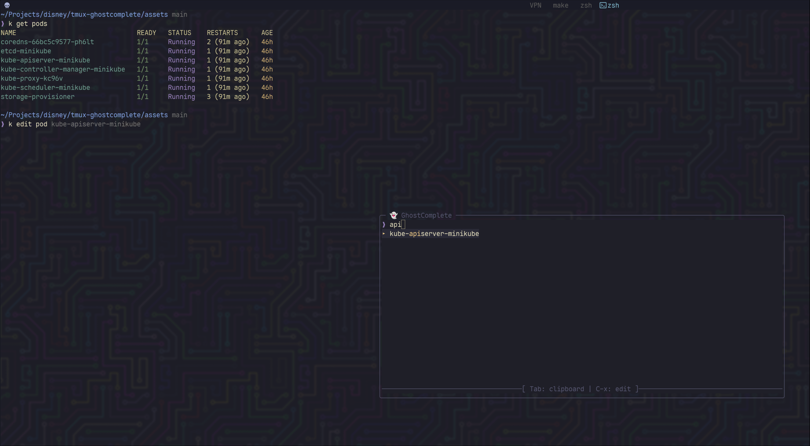
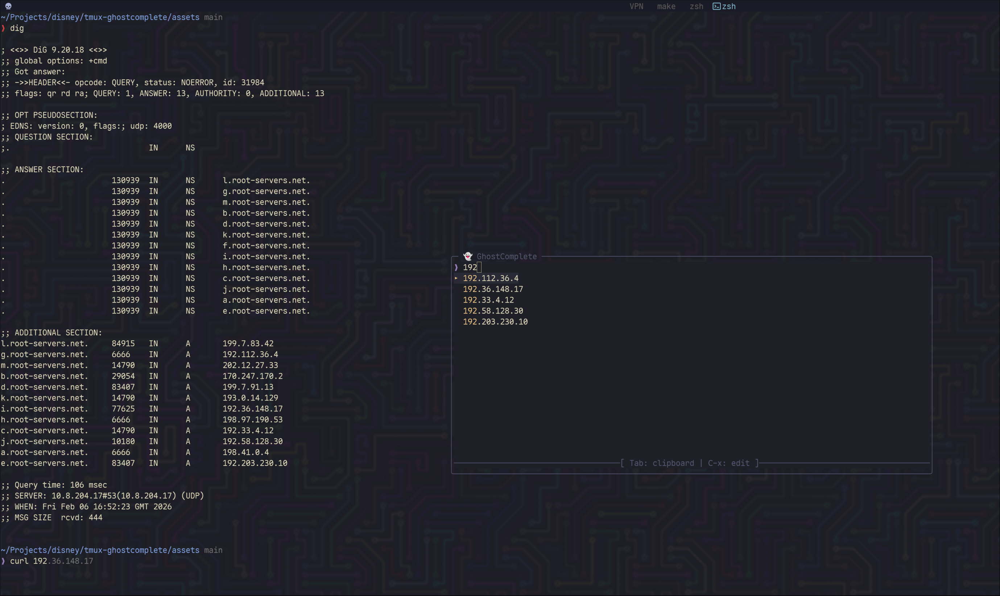
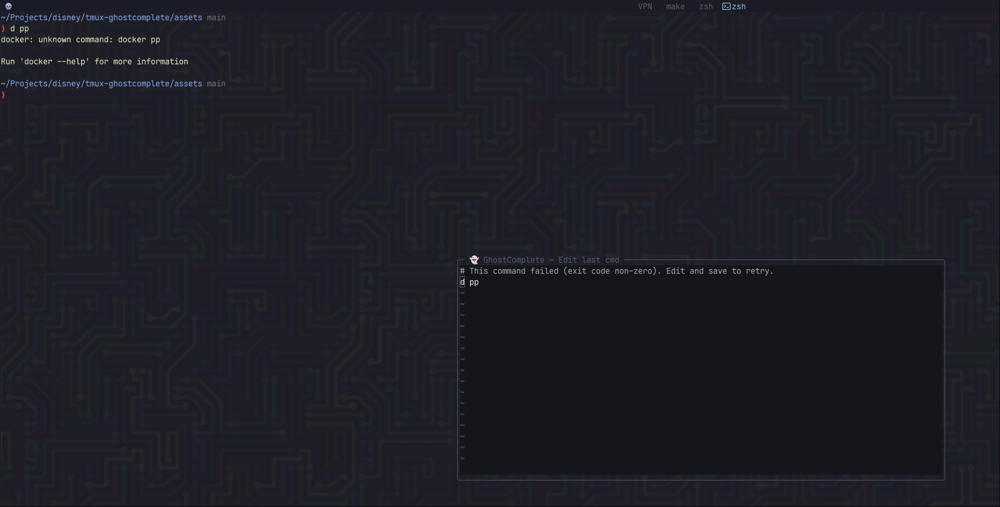
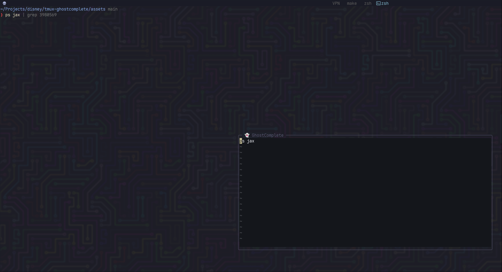
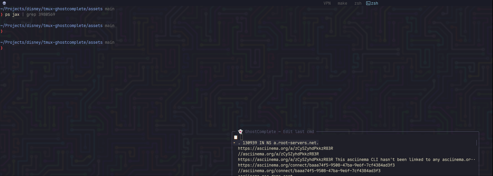

<div align="center">


# tmux-ghostcomplete

**Screen-aware autocomplete for your terminal**

Complete text from anywhere visible in your tmux pane with a fuzzy finder popup.

[](LICENSE)
[](https://www.zsh.org/)
[](https://github.com/tmux/tmux)

---

### 🤖 Built entirely with AI

This project was created from scratch through conversation with [Claude](https://www.anthropic.com/claude) using [OpenCode](https://github.com/anomalyco/opencode) - no code was written manually.

---

</div>

## Demo


---

## Screenshots

### Token Completion
Complete pod names, paths, and identifiers from kubectl output:



### IP Address Completion
Quickly grab IP addresses from dig output:



### Edit Failed Commands
When a command fails, press `Ctrl+n` then `Ctrl+x` to edit it in nvim:



### Nvim Editor
Edit commands with full vim motions - comment shows why you're editing:



### Clipboard History
Press `Tab` to switch to clipboard history mode:



---

## What is this?

Ever had a long path, URL, or identifier on screen and wished you could just autocomplete it without copy-pasting? **tmux-ghostcomplete** does exactly that.

Press `Ctrl+n` and a popup appears with all the text tokens visible in your current tmux pane. Start typing to filter, press Enter to insert the selection into your command line.

### Features

- **Screen-aware** - Extracts all visible text from your tmux pane
- **Exact matching** - Uses fzf with exact substring matching (no fuzzy)
- **Smart completion** - Intelligently handles delimiters to avoid duplication
- **Styled floating popup** - Subtle rounded borders with Kanagawa-themed colors
- **Toggle to close** - Press `Ctrl+n` again to dismiss (or Escape)
- **Clipboard history** - Press Tab to access clipboard history (via cliphist)
- **Command line editor** - Press Ctrl+x to edit your command in nvim
- **Edit failed commands** - Automatically loads last failed command for quick fixes
- **History search** - Press `Ctrl+f` to search through full scrollback history
- **Fast** - Optimized with `sh` and single `awk` for minimal latency
- **Live highlighting** - Matches are highlighted in your terminal as you scroll


## Live Match Highlighting

As you scroll through completions, matching text is **highlighted in your terminal pane** so you can see exactly where each token came from.

### How It Works

- **Green highlight** (bright green `#00FF00`, underlined) - Current match (bottom-most occurrence)
- **Yellow highlight** (carpYellow `#E6C384` on sumiInk0) - Other matches on screen

The highlighting:
- Only shows matches **within the visible area** (no scrollback)
- Prioritizes the **bottom-most match** (most recent)
- Automatically cleans up when you select or cancel

### Visual Example

```
┌─────────────────────────────────┐
│ $ kubectl get pods              │
│ NAME            READY   STATUS  │
│ api-server      1/1     Running │  ← gray highlight
│ api-worker      1/1     Running │  ← purple highlight (current)
│                                 │
│ ╭─ 👻 GhostComplete ──────────╮ │
│ │ ▸ api-worker                │ │  ← focused item
│ │   api-server                │ │
│ ╰─────────────────────────────╯ │
└─────────────────────────────────┘
```

## Requirements

- [tmux](https://github.com/tmux/tmux) (with `display-popup` support, v3.2+)
- [fzf](https://github.com/junegunn/fzf)
- [zsh](https://www.zsh.org/)
- [cliphist](https://github.com/sentriz/cliphist) (optional, for clipboard history)
- [wl-copy](https://github.com/bugaevc/wl-clipboard) (optional, for Wayland clipboard)
- [nvim](https://neovim.io/) (optional, for command line editing)

## Installation

### Manual

1. Clone the repository:
   ```bash
   git clone https://github.com/bechampion/tmux-ghostcomplete.git ~/.zsh/plugins/tmux-ghostcomplete
   ```

2. Copy the tokenizer script:
   ```bash
   cp ~/.zsh/plugins/tmux-ghostcomplete/bin/tmux-ghostcomplete ~/.local/bin/
   chmod +x ~/.local/bin/tmux-ghostcomplete
   ```

3. Add to your `~/.zshrc`:
   ```bash
   source ~/.zsh/plugins/tmux-ghostcomplete/tmux-ghostcomplete.plugin.zsh
   ```

4. Reload your shell:
   ```bash
   source ~/.zshrc
   ```

### Quick Install

```bash
git clone https://github.com/bechampion/tmux-ghostcomplete.git /tmp/tmux-ghostcomplete
cd /tmp/tmux-ghostcomplete && ./install.sh
```

### Using a Plugin Manager

<details>
<summary><b>zinit</b></summary>

```bash
zinit light bechampion/tmux-ghostcomplete
```
</details>

<details>
<summary><b>zplug</b></summary>

```bash
zplug "bechampion/tmux-ghostcomplete"
```
</details>

<details>
<summary><b>antigen</b></summary>

```bash
antigen bundle bechampion/tmux-ghostcomplete
```
</details>

---

## Usage

### Keybindings

| Key | Action |
|-----|--------|
| `Ctrl+n` | Open GhostComplete popup (press again to close) |
| `Ctrl+f` | Open history search (search full scrollback) |
| `Tab` | Toggle between **tokens** and **clipboard history** |
| `Ctrl+x` | Open **nvim** to edit command line |
| `Enter` | Select and insert (or search in `Ctrl+f` mode) |
| `Escape` | Close popup |

### Basic Usage

1. Open a tmux session
2. Have some text visible on screen (commands, output, logs, etc.)
3. Press `Ctrl+n`
4. Type to filter the tokens (exact matching)
5. Press `Enter` to insert the selection
6. Press `Escape` or `Ctrl+n` to cancel

The selected text is also copied to your clipboard (Wayland).

---

## History Search (Ctrl+f)

Press `Ctrl+f` to open a simple search prompt that searches through your **full tmux scrollback history**.

### How It Works

```
╭─ 📜 History Search ─╮
│ ❯ your search term  │
╰─────────────────────╯
```

1. Type your search term
2. Press `Enter` to search - tmux enters copy-mode and highlights all matches
3. Press `Escape`, `Ctrl+f`, or `Ctrl+c` to cancel

### Keybindings

| Key | Action |
|-----|--------|
| `Enter` | Search for the term in tmux scrollback |
| `↑` / `Ctrl+p` | Previous search from history |
| `↓` / `Ctrl+n` | Next search from history |
| `←` / `→` | Move cursor |
| `Ctrl+←` / `Ctrl+→` | Move by word |
| `Ctrl+a` / `Ctrl+e` | Beginning / end of line |
| `Ctrl+w` | Delete word backwards |
| `Backspace` / `Delete` | Delete character |
| `Escape` / `Ctrl+f` / `Ctrl+c` | Cancel |

### Features

- Searches **full scrollback** (not just visible area)
- **Kanagawa-themed highlighting** - green for current match, yellow for others
- **No tokenization** - search for any text, including spaces
- **Quick toggle** - press `Ctrl+f` again to close
- **Search history** - navigate previous searches with `↑`/`↓` or `Ctrl+p`/`Ctrl+n`
- History stored in `~/.local/share/tmux-ghostcomplete/search_history`

### Use Cases

- Find that error message from earlier
- Search for a specific command you ran
- Locate a URL or path in your history
- Find text that scrolled off screen
---

## Popup Appearance

The popup uses tmux's native styling for a clean, minimal look:

```
╭─ 👻 GhostComplete ────────────────╮
│ ❯ search query                    │
│ ▸ matching-token-1                │
│   matching-token-2                │
│   matching-token-3                │
│ ────────────────────────────────  │
│ [ Tab: clipboard | C-x: edit ]    │
╰───────────────────────────────────╯
```

---

## Command Line Editor

Press `Ctrl+x` while in the GhostComplete popup to open your command in **nvim** for editing.

### Editing Current Command

If you have text in your prompt, `Ctrl+x` opens it in nvim:

```
# You have this complex command:
$ kubectl get pods -n production | grep -E "api|web" | awk '{print $1}'

# Press Ctrl+n, then Ctrl+x
# nvim opens with the command
# Edit it with full vim motions
# :wq to save and return to shell
```

### Editing Failed Commands

If your prompt is **empty** and the **last command failed** (`$? != 0`), `Ctrl+x` automatically loads that failed command:

```
# You run a command with a typo:
$ kubetcl get pods
zsh: command not found: kubetcl

# Prompt is now empty
# Press Ctrl+n - notice the title shows "Edit last cmd"
# Press Ctrl+x
# nvim opens with "kubetcl get pods"
# Fix the typo and :wq
# The corrected command is ready to run!
```

The popup shows visual indicators when this mode is active:
- **Title**: `👻 GhostComplete ~ Edit last cmd`
- **Label**: `[ Tab: clipboard | C-x: edit last cmd ]`

### nvim Configuration

The editor opens with a minimal configuration for speed:
- No swap files
- No backup files  
- No undo files
- No status line

### Use Cases

- **Fix failed commands** - Quickly edit and re-run commands that errored
- **Complex pipelines** - Edit long commands with multiple pipes
- **Fix typos** - Use vim motions to quickly fix errors
- **Restructure commands** - Rearrange arguments and flags

---

## Clipboard History

Press `Tab` to toggle between screen tokens and clipboard history.

### Modes

**Tokens mode** (default) - Shows text from your visible tmux pane:
```
╭─ 👻 GhostComplete ────────────────╮
│ ❯ search query                    │
│ ▸ token-from-screen               │
│ [ Tab: clipboard | C-x: edit ]    │
╰───────────────────────────────────╯
```

**Clipboard mode** - Shows your clipboard history:
```
╭─ 👻 GhostComplete ────────────────╮
│ 📋 search query                   │
│ ▸ previous-clipboard-entry        │
│ [ Tab: tokens | C-x: edit ]       │
╰───────────────────────────────────╯
```

### Setting up cliphist

Clipboard history requires [cliphist](https://github.com/sentriz/cliphist). Add this to your Sway/Hyprland config:

**Sway:**
```bash
exec wl-paste --type text --watch cliphist store
exec wl-paste --type image --watch cliphist store
```

**Hyprland:**
```bash
exec-once = wl-paste --type text --watch cliphist store
exec-once = wl-paste --type image --watch cliphist store
```

---

## Smart Completion Behavior

The plugin intelligently handles text insertion based on delimiters to avoid duplication.

### Delimiters

The following characters are recognized as delimiters:

```
/ : , @ ( ) [ ] = " '
```

### How It Works

When you press `Ctrl+n`, the plugin looks at what you've typed and:

1. **Extracts the query** - Uses only the text after the last delimiter for filtering
2. **Avoids duplication** - When inserting, strips any overlapping prefix
3. **Query changes** - If you modify the query in the popup, the selection replaces your typed word

### Examples

#### Building URLs

```
# You type:
curl http://192

# Popup filters to tokens containing "192"
# You select: 192.168.1.100

# Result (192 is stripped to avoid duplication):
curl http://192.168.1.100
```

#### Building Paths

```
# You type:
cat /var/log/sys

# Popup filters to tokens containing "sys"
# You select: syslog

# Result:
cat /var/log/syslog
```

---

## Token Exceptions

The tokenizer preserves certain patterns intact instead of splitting them:

| Pattern | Example |
|---------|---------|
| `http://`, `https://` | `https://github.com/user/repo` |
| `git@` | `git@github.com:user/repo.git` |
| `ftp://`, `file://` | `ftp://files.example.com/path` |
| `containerd://` | `containerd://k8s.io/container` |
| `s3://` | `s3://bucket/path` |
| IPv6 addresses | `2001:0db8:85a3::8a2e:0370:7334` |

---

## Configuration

### Key Binding

Change the trigger key in the plugin file:

```bash
# Default: Ctrl+n for completion, Ctrl+f for history search
bindkey '^n' _gc_complete
bindkey '^f' _gc_history_search

# Example: Ctrl+Space for completion
bindkey '^ ' _gc_complete
```

### Popup Size

Modify in `tmux-ghostcomplete.plugin.zsh`:

```bash
tmux display-popup -E -w 35% -h 30% \
    -b rounded \
    -S 'fg=#54546D' \
    -s 'bg=#1F1F28' \
    -T ' 👻 GhostComplete '
```

### Colors (Kanagawa Theme)

The popup uses [Kanagawa](https://github.com/rebelot/kanagawa.nvim) colors:

| Element | Color | Description |
|---------|-------|-------------|
| `bg` | `#1F1F28` | Background (sumiInk1) |
| `fg` | `#DCD7BA` | Text (fujiWhite) |
| `bg+` | `#2A2A37` | Selected background (sumiInk4) |
| `hl` | `#E6C384` | Match highlight (carpYellow) |
| `prompt` | `#957FB8` | Prompt (oniViolet) |

---

## Troubleshooting

### Popup doesn't appear
- Make sure you're inside a tmux session
- Check tmux version: `tmux -V` (needs 3.2+)

### No tokens showing
- There might not be any text longer than 3 characters on screen
- Try reducing the minimum token length in the tokenizer

### Escape key causes issues
Add this to your `~/.zshrc`:

```zsh
bindkey '^[' redisplay
```

---

## Related Projects

- [fzf](https://github.com/junegunn/fzf) - The fuzzy finder powering this plugin
- [cliphist](https://github.com/sentriz/cliphist) - Clipboard history manager
- [tmux](https://github.com/tmux/tmux) - Terminal multiplexer
- [kanagawa.nvim](https://github.com/rebelot/kanagawa.nvim) - The colorscheme inspiration

## License

MIT License - See [LICENSE](LICENSE) for details.

---

## Disclaimer

> **Note**: This project was created entirely through conversation with [Claude](https://www.anthropic.com/claude) (Anthropic's AI assistant) using [OpenCode](https://github.com/anomalyco/opencode). The author prompted and directed the development but did not write the code directly.

---

<div align="center">
Made with AI-assisted terminal love 🤖
<br><br>
<a href="https://github.com/anomalyco/opencode"></a>
<a href="https://www.anthropic.com/claude"></a>
</div>
