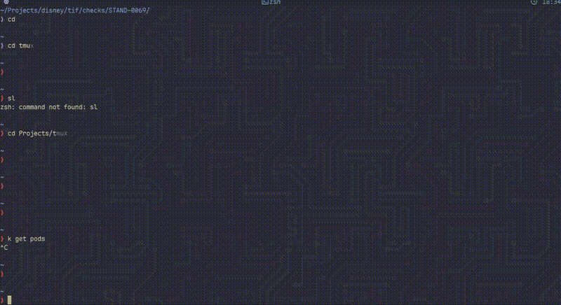
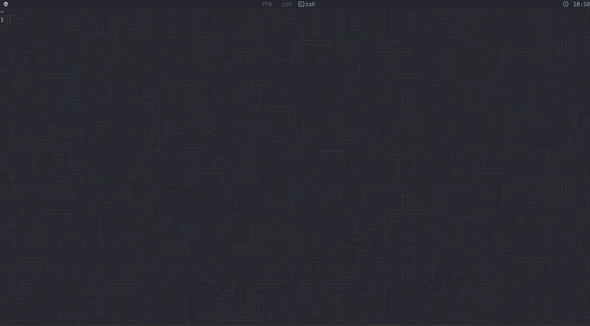

<div align="center">


# tmux-ghostcomplete

**Screen-aware autocomplete for your terminal**

Complete text from anywhere visible in your tmux pane with a fuzzy finder popup.

[](LICENSE)
[](https://www.zsh.org/)
[](https://github.com/tmux/tmux)

---

### 🤖 Built entirely with AI

This project was created from scratch through conversation with [Claude](https://www.anthropic.com/claude) using [OpenCode](https://github.com/anomalyco/opencode) - no code was written manually.

---

</div>

## Demo

<!-- Demo GIF -->



---

## What is this?

Ever had a long path, URL, or identifier on screen and wished you could just autocomplete it without copy-pasting? **tmux-ghostcomplete** does exactly that.

Press `Ctrl+n` and a popup appears with all the text tokens visible in your current tmux pane. Start typing to filter, press Enter to insert the selection into your command line.

### Features

- **Screen-aware** - Extracts all visible text from your tmux pane
- **Exact matching** - Uses fzf with exact substring matching (no fuzzy)
- **Smart completion** - Intelligently handles delimiters to avoid duplication
- **Floating popup** - Clean, centered popup that doesn't disrupt your workflow
- **Clipboard integration** - Selected text is also copied to your Wayland clipboard
- **Fast** - Optimized with `sh` and single `awk` for minimal latency
- **Kanagawa themed** - Beautiful colors that match the Kanagawa colorscheme (customizable)

## Requirements

- [tmux](https://github.com/tmux/tmux) (with `display-popup` support, v3.2+)
- [fzf](https://github.com/junegunn/fzf)
- [zsh](https://www.zsh.org/)
- [wl-copy](https://github.com/bugaevc/wl-clipboard) (optional, for Wayland clipboard)

## Installation

### Manual

1. Clone the repository:
   ```bash
   git clone https://github.com/bechampion/tmux-ghostcomplete.git ~/.zsh/plugins/tmux-ghostcomplete
   ```

2. Copy the tokenizer script:
   ```bash
   cp ~/.zsh/plugins/tmux-ghostcomplete/bin/tmux-ghostcomplete ~/.local/bin/
   chmod +x ~/.local/bin/tmux-ghostcomplete
   ```

3. Add to your `~/.zshrc`:
   ```bash
   source ~/.zsh/plugins/tmux-ghostcomplete/tmux-ghostcomplete.plugin.zsh
   ```

4. Reload your shell:
   ```bash
   source ~/.zshrc
   ```

### Quick Install

```bash
git clone https://github.com/bechampion/tmux-ghostcomplete.git /tmp/tmux-ghostcomplete
cd /tmp/tmux-ghostcomplete && ./install.sh
```

### Using a Plugin Manager

<details>
<summary><b>zinit</b></summary>

```bash
zinit light bechampion/tmux-ghostcomplete
```
</details>

<details>
<summary><b>zplug</b></summary>

```bash
zplug "bechampion/tmux-ghostcomplete"
```
</details>

<details>
<summary><b>antigen</b></summary>

```bash
antigen bundle bechampion/tmux-ghostcomplete
```
</details>

## Usage

1. Open a tmux session
2. Have some text visible on screen (commands, output, logs, etc.)
3. Press `Ctrl+n`
4. Type to filter the tokens (exact matching)
5. Press `Enter` to insert the selection
6. Press `Escape` to cancel

The selected text is also copied to your clipboard (Wayland).

---

## Smart Completion Behavior

The plugin intelligently handles text insertion based on delimiters to avoid duplication.




### Delimiters

The following characters are recognized as delimiters:

```
/ : , @ ( ) [ ] =
```

### How It Works

When you press `Ctrl+n`, the plugin looks at what you've typed and:

1. **Extracts the query** - Uses only the text after the last delimiter for filtering
2. **Avoids duplication** - When inserting, strips any overlapping prefix

### Examples

#### Building URLs

```
# You type:
curl http://

# Popup shows all tokens (no filter since you ended with /)
# You select: 192.168.1.100

# Result:
curl http://192.168.1.100
```

```
# You type:
curl http://192

# Popup filters to tokens containing "192"
# You select: 192.168.1.100

# Result (192 is stripped to avoid duplication):
curl http://192.168.1.100
```

#### Building Paths

```
# You type:
cd /home/user/

# Popup shows all tokens (no filter)
# You select: Projects

# Result:
cd /home/user/Projects
```

```
# You type:
cat /var/log/sys

# Popup filters to tokens containing "sys"
# You select: syslog

# Result:
cat /var/log/syslog
```

#### Email Addresses

```
# You type:
git config user.email user@

# Popup shows all tokens (no filter)
# You select: example.com

# Result:
git config user.email user@example.com
```

#### Simple Completion (No Delimiters)

```
# You type:
kubectl get dep

# Popup filters to tokens containing "dep"
# You select: deployments

# Result:
kubectl get deployments
```

```
# You type (empty):
git clone 

# Popup shows all tokens
# You select: git@github.com:user/repo.git

# Result:
git clone git@github.com:user/repo.git
```

### Customizing Delimiters

You can modify the delimiter list in `tmux-ghostcomplete.plugin.zsh`:

```zsh
# Default delimiters
local delimiters='/:,@()[]='

# Add more delimiters (e.g., #, ?, &, -)
local delimiters='/:,@()[]=#?&-'
```

---

## Configuration

### Key Binding

Change the trigger key by modifying the `bindkey` line in the plugin file:

```bash
# Default: Ctrl+n
bindkey '^n' _gc_complete

# Example: Ctrl+Space
bindkey '^ ' _gc_complete

# Example: Alt+c
bindkey '^[c' _gc_complete
```

### Popup Size and Position

Modify these values in `tmux-ghostcomplete.plugin.zsh`:

```bash
# Width: 25%, Height: 40%, Centered
tmux display-popup -E -B -w 25% -h 40% -x C -y C
```

Options:
- `-w` - Width (percentage or columns)
- `-h` - Height (percentage or rows)
- `-x` - X position (`C` for center, `R` for right, or number)
- `-y` - Y position (`C` for center, `S` for bottom, or number)

### Colors (Kanagawa Theme)

The default colors match the [Kanagawa](https://github.com/rebelot/kanagawa.nvim) colorscheme:

```bash
--color='hl:#7E9CD8,hl+:#E6C384,fg+:#DCD7BA,bg+:#2A2A37,pointer:#E6C384,prompt:#7E9CD8,border:#3B3B4D'
```

| Element | Color | Description |
|---------|-------|-------------|
| `hl` | `#7E9CD8` | Match highlight (crystalBlue) |
| `hl+` | `#E6C384` | Selected match highlight (carpYellow) |
| `fg+` | `#DCD7BA` | Selected line text (fujiWhite) |
| `bg+` | `#2A2A37` | Selected line background (sumiInk4) |
| `pointer` | `#E6C384` | Pointer color (carpYellow) |
| `prompt` | `#7E9CD8` | Prompt color (crystalBlue) |
| `border` | `#3B3B4D` | Border color (sumiInk5) |

---

## The Tokenizer

The tokenizer (`bin/tmux-ghostcomplete`) is responsible for extracting meaningful text from your terminal. It's written in POSIX `sh` with a single `awk` process for maximum performance.

### How It Works

```
┌─────────────────┐     ┌─────────────────┐     ┌─────────────────┐
│  tmux capture   │────▶│   awk process   │────▶│  unique tokens  │
│  (visible pane) │     │  (tokenize)     │     │  (to fzf)       │
└─────────────────┘     └─────────────────┘     └─────────────────┘
```

1. **Capture**: `tmux capture-pane -p` grabs all visible text from the current pane
2. **Clean**: Removes brackets `[]`, parentheses `()`, colons `:`, and quotes `"`
3. **Split**: Breaks text into whitespace-separated words
4. **Filter**: Only keeps tokens longer than 4 characters
5. **Dedupe**: Uses awk's associative array to output each unique token once

### Source Code

```sh
#!/bin/sh
target_pane="$2"

if [ -n "$target_pane" ]; then
    tmux capture-pane -t "$target_pane" -p
else
    tmux capture-pane -p
fi | awk '
{
    # Replace brackets, parens, colons, quotes with spaces
    gsub(/[\[\]():"]/, " ")
    # Split into words
    n = split($0, words)
    for (i = 1; i <= n; i++) {
        w = words[i]
        # Only output tokens > 4 chars, deduplicated
        if (length(w) > 4 && !seen[w]++) {
            print w
        }
    }
}'
```

### Customization

#### Minimum Token Length

Change `> 4` to your preferred minimum:

```awk
# Show tokens with 2+ characters
if (length(w) > 1 && !seen[w]++) {

# Show tokens with 8+ characters  
if (length(w) > 7 && !seen[w]++) {
```

#### Additional Characters to Strip

Add more characters to the `gsub` pattern:

```awk
# Also remove angle brackets, semicolons, commas
gsub(/[\[\]():"<>;,]/, " ")
```

#### Keep Certain Patterns Intact

To preserve URLs or paths, you could modify the tokenizer:

```awk
# Don't split on colons for URLs
gsub(/[\[\]()"]/, " ")
```

#### Performance

The tokenizer is optimized for speed:
- Uses `/bin/sh` instead of bash/zsh (faster shell startup)
- Single `awk` process (no pipes between sed, tr, grep, sort)
- Deduplication happens in-memory during processing
- No temporary files

On a typical terminal with ~50-100 lines visible, tokenization completes in **<10ms**.

---

## Troubleshooting

### Popup doesn't appear
- Make sure you're inside a tmux session
- Check tmux version: `tmux -V` (needs 3.2+)

### No tokens showing
- There might not be any text longer than 4 characters on screen
- Try reducing the minimum token length

### Escape key causes issues
If pressing Escape causes your shell to enter vi command mode or ring a bell, add this to your `~/.zshrc`:

```zsh
bindkey '^[' redisplay
```

This makes Escape do nothing (just redraws the prompt) while preserving Alt+key combinations.

### Slow popup
- The script is already optimized, but very large panes might be slower
- Consider reducing scrollback if you have very large buffers

## Related Projects

- [fzf](https://github.com/junegunn/fzf) - The fuzzy finder powering this plugin
- [tmux](https://github.com/tmux/tmux) - Terminal multiplexer
- [zsh-autosuggestions](https://github.com/zsh-users/zsh-autosuggestions) - History-based suggestions
- [kanagawa.nvim](https://github.com/rebelot/kanagawa.nvim) - The colorscheme inspiration

## License

MIT License - See [LICENSE](LICENSE) for details.

## Contributing

Contributions are welcome! Feel free to open issues or submit pull requests.

---

## Disclaimer

> **Note**: This project was created entirely through conversation with [Claude](https://www.anthropic.com/claude) (Anthropic's AI assistant) using [OpenCode](https://github.com/anomalyco/opencode). The author prompted and directed the development but did not write the code directly. Use at your own risk - the author assumes no responsibility for any issues, damages, or unexpected behavior that may arise from using this software.

---

<div align="center">
Made with AI-assisted terminal love 🤖
<br><br>
<a href="https://github.com/anomalyco/opencode"></a>
<a href="https://www.anthropic.com/claude"></a>
</div>
